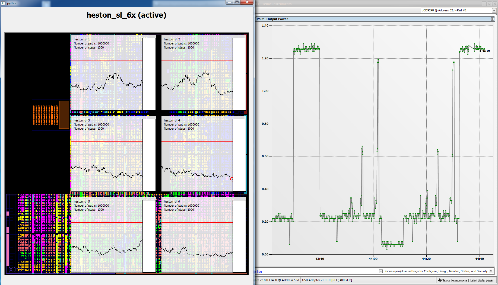

finance.zynqpricer.hls
======================

Heston implementation for Zynq with Vivado HLS

Motivation:
-----------

The Zynq platform offers some very appealing features for rapid accelerator 
development including:
- Full features Linux distribution (Linaro Ubuntu) running on ARM with ssh 
  access, packet manager, threading support
- Can run almost any cross platform software package (QuantLib, scikit-learn, 
  SystemC, Python, Boost, OpenMPI, Git, etc.)
- Dynamic reconfiguration of the FPGA in < 200 ms from Linux command line,
  during runtime
- Low latency (~ 100 ns) and high bandwidth (1.6 GiB/s) interconnect between 
  FPGA and ARM
- C++ user space driver development possible. Compile debug and benchmark
  programs like on a Desktop Linux system
- High level accelerator description possible base on the new Vivado HLS
- Automatic AXI-Stream and memory mapped AXI interface generation

This work will apply this powerfull setup to our financial application 
"option pricing". The goal is to implement a fully features SL / ML heston 
pricer that beats all our current implementations in:
- Productivity: lines of code
- Energy efficiency: steps / watt
- Implementation efficiency: FPGA area / accelerator
- Functionality: fully working and optimized implementations (FPGA & CPU)
- Features: heston sl & ml, full benchmark

Repository Structure
--------------------

- bitstream: FPGA bitstreams containing accelerators for Zynq
- hls: Accelerators written with Vivado HLS
- ip: Packed HLS accelerators, that can be instanciated and synthesized 
  with Vivado
- linux: Kernels, boot images and discription on how to install linux
- results: deliverables of this project
- software: linux drivers for the accelerators and optimized CPU 
  implementations for heston

See the individual folders for more information.

Zynq Demo
---------

The Zynq demo can be found in the [software folder](software). Additional instructions can be found there.

